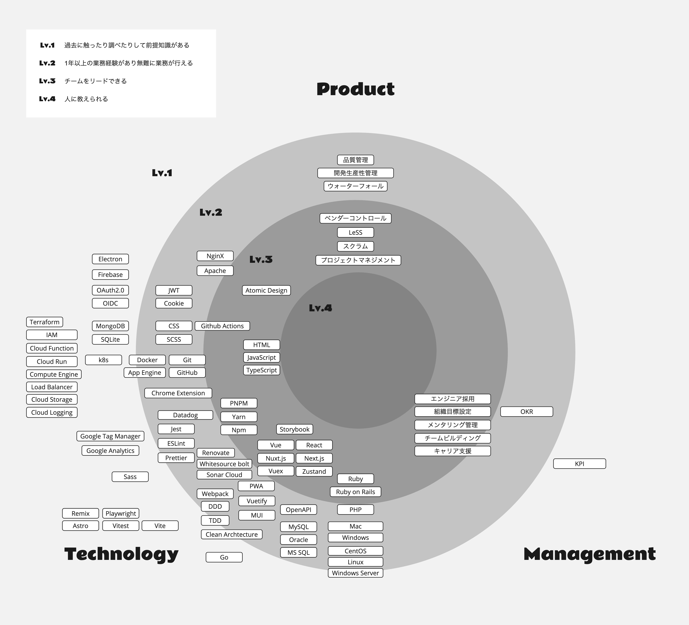

# 職務経歴

## プロフィール

**氏名**: 西澤 翔利  
**生年月日**: 1988年1月28日  
**現職**: パーソルキャリア株式会社 マネジャー

## スキル

---

## 経歴

### **パーソルキャリア株式会社（2021年4月〜現在）**
**業界**: 人材  
**雇用形態**: 正社員  
**役職**:  
- エンジニア（2021年4月〜2022年3月）  
- リードエンジニア（2022年4月〜2023年9月）  
- マネージャー（2023年10月〜2025年3月）  
- ゼネラルマネージャー（2025年4月〜）

#### **人材紹介領域の法人プロダクトの組織開発**（2025年4月〜現在）
TBD

#### **HR forecaster プロジェクトマネジメント・組織開発**（2023年10月〜現在）
- 5つの開発チームを統括し、組織目標を設定（OKR）
- 採用・評価制度の改善
- プロダクト品質向上施策の推進

#### **HR forecaster ヒアリングノートの開発**（2022年8月〜現在）
- 0→1フェーズのプロダクト開発
- フロントエンドアーキテクチャの構築・インフラ設計
- スクラムマスターとして開発プロセスの改善  
**技術**: JavaScript, TypeScript, React, Zustand, Next.js, GCP, Firebase, Jest, Github Actions  

#### **HR forecaster ターゲット設定の開発**（2021年4月〜現在）
- フロントエンド機能開発・CMS構成の構築
- プロダクト品質向上のための施策推進  
**技術**: JavaScript, Vue.js, Nuxt.js, GCP, Firebase, Jest, Github Actions  

#### **新卒研修 プロジェクトリーダー（エンジニア）**（2021年10月〜2022年7月）
- エンジニア研修のコンテンツ設計・資料作成
- デザイナーとの合同研修の企画・実施

---

### **株式会社ディスコ（2018年8月〜2021年3月）**
**業界**: 半導体  
**雇用形態**: 正社員  
**役職**: 主任（2019年4月〜2021年3月）  

#### **権限管理システムの刷新**（2020年6月〜2021年3月）
- 既存の権限管理システムを教育・テスト用途に拡張  
**技術**: Ruby, Ruby on Rails, Vue.js, Jest, MySQL, Docker, Nginx  

#### **社内向け仕事オークションサイトの新規開発**（2019年11月〜2020年4月）
- 社内業務をオークション形式で取り合うシステムを開発  
**技術**: Ruby, Ruby on Rails, Vue.js, Jest, MySQL, Sidekiq(Redis)  

#### **社内権限管理システムの新規開発**（2018年12月〜2019年4月）
- e-Learning機能、ワークフロー機能、誓約書・権限管理機能の開発  
**技術**: Ruby, Rails, Vue.js, MySQL  

---

### **スポーツニッポン新聞社（2010年4月〜2018年7月）**
**業界**: マスコミ  
**雇用形態**: 正社員  

#### **社内向け記者業務アプリの新規開発**（2017年4月〜2018年5月）
- 記者が記事・写真をモバイルから送信できるAndroidアプリを開発  
**技術**: Monaca, OnsenUI, AngularJS, Node.js  

#### **新聞即売システムの刷新**（2016年12月〜2017年3月）
- コンビニ・駅売りの新聞販売情報管理システムの開発  
**技術**: PHP, Smarty, Oracle  

#### **新聞販売業務システム統合（フェーズ1・2）**（2011年12月〜2014年4月）
- 新聞販売店の部数・請求管理、輸送ルート管理システムの開発  
- ベンダーコントロール、要件定義〜導入・運用まで  
**技術**: PHP, Smarty, Oracle, Business Object(SAP)  

---

## 寄稿・取材等
- [ベトナムで海外拠点メンバーと開発キックオフを開催しました](https://note.hr-forecaster.jp/n/ndede54cd07bb)
- [データを活用して“採用のものさし”を提供する―「HR forecaster」の魅力と開発にかける思い](https://techdoor.persol-group.co.jp/contents/4028/)
- [エンジニアが社内起業制度で起案した話](https://techtekt.persol-career.co.jp/entry/culture/20231201_01)
- [【イベントレポート】アジャイル開発「スクラム」って各社どうしてる?エンジニア知見共有会](https://www.tech-street.jp/entry/2023/05/11/135004)
- [人材サービス企業だけが握る採用データの「民主化」を実現したHR forecaster。グロース期に入り求人要件の最適化に欠かせない業界標準ツールを目指す](https://www.persol-career.co.jp/recruit/career/hataraction/project/project-hrforecaster/)
- [OpenAPI × Orval × MSW × Next.jsでのスキーマ駆動開発実践](https://techtekt.persol-career.co.jp/entry/tech/221215_01)
- [今年はエンジニア×デザイナーの合同開催！サービス開発部　新卒研修2022のプログラムを聞いてみた](https://techtekt.persol-career.co.jp/entry/culture/220804_01)

---

## SNS
- [Github](https://github.com/shooooori0128)
- [LinkedIn](https://www.linkedin.com/in/shori-nishizawa/)
- [YouTrust](https://youtrust.jp/users/shooooori0128)
